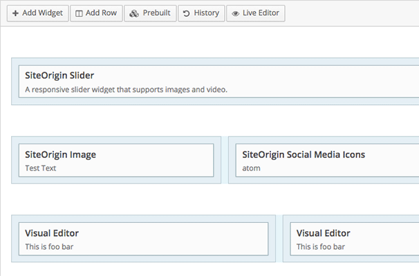
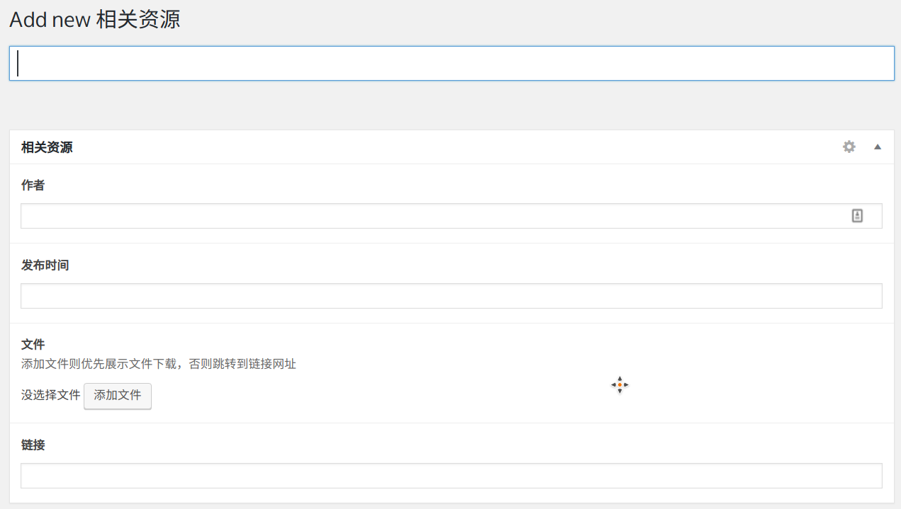

# WordPress建站基本思路

WordPress是个开源自由的工具，同时拥有丰富的插件，因此如何使用WordPress建站是没有确定准则的。

网络上的WordPress教程大多只是点到为止，举例的都是结构非常简单的官网。而国外非常流行的WordPress收费模板，虽然设计精美、后台功能丰富，但毕竟是通用模板，功能追求多而全，使得后台难以定制，且很多插件不符合中国人的使用习惯。

不过，网上的关于WordPress零散知识的文章非常多，几乎你能想到的任何一种调用指定数据的需求，都能在网上找到答案。如何打造一套建站的基本思路，让建站过程更加顺畅，同时普通后台用户能够轻松管理内容，才是最重要的。

现在流行的WordPress建站思路主要有两种：

## 1. 页面构建器模式

这种模式借助一些收费或者免费的页面构建插件，能够通过拖动插件来快速构建多栏布局，添加内容挂件，同时还支持响应式设计。国外的收费模板大多是这种模式，利用页面构建器预先设计定义了一大堆的页面模板，用户只需要修改内容，也可以根据自己的需要增删内容。

常用的页面构建器可参考这篇文章：https://www.wpbeginner.com/beginners-guide/best-drag-and-drop-page-builders-for-wordpress/

虽然这种建站思路比较灵活，拓展性强，但要求用户要有一定的编写网页技术，才能利用页面构建器去管理自己的内容。这对于普通用户来说是个很大的挑战。

## 2. 定制内容字段模式

这种模式需要根据网站的特点，定义好各个栏目内容的文章类型，并为这些类型添加自定义字段。这样用户在后台添加修改文章时，看到的是如同表单一样填写的内容，而在前台则是在写好的模板上调用后台的自定义字段内容即可。

这种模式的定制性非常强，用户在后台看到的是非常简洁的表单填写界面，只要对照字段名称和前台展示的内容，就清楚自己要修改的内容在哪里了。缺点是定死了每个文章类型的字段，用户无法自行添加内容，因此需要在定义字段时考虑周全。

从外包的角度看，我们基本采用的都是第二种模式。因为外包客户一般都不具备丰富的网络知识，很难理解第一种模式的使用方法；而且企业网站的内容架构一旦定下来就很少变动，使用第二种会更合适。