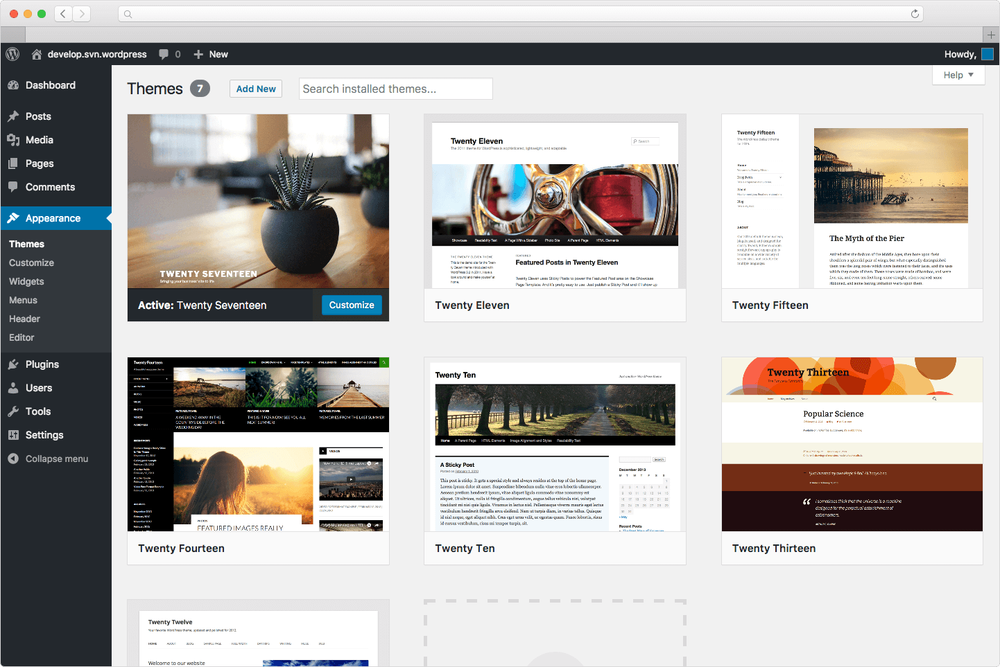

# WordPress简介

WordPress是一个历史非常悠久的开源系统。谈到WordPress，已经很难定义它是个什么样的开源系统。最初，它一般被用于搭建“博客”，即一种主要用来发布图文混排文章的内容系统。但得益于WordPress的开放性，人们不断开发各种插件来增强它的功能，使得它成为了全球最出名的内容管理系统（CMS）。引用维基百科的介绍：

WordPress是一个以PHP和MySQL为平台的自由开源的博客软件和内容管理系统。WordPress具有插件架构和模板系统。截至2018年4月，排名前1000万的网站超过30.6%使用WordPress。WordPress是最受欢迎的网站内容管理系统。WordPress是当前因特网上最流行的博客系统。WordPress在最着名的网络发布阶段中脱颖而出。如今，它被使用在超过7000万个站点上。

## 为什么使用WordPress？

所谓CMS，它的主要功能就是管理多层级、复杂内容架构的展示性内容。CMS一般没有复杂的用户交互逻辑，但对内容的后台管理要求比较高，前台的内容展示一般也有复杂的关联逻辑。所以，好的CMS要求能够灵活的定义不同内容类型的字段，并提供简洁、容易调用的前台模板架构。

而WordPress正好完美地契合了这些特性，它本身为简洁的博客系统，具有基础的文章、页面及分类数据结构，同时允许自定义文章类型，支持自定义模板，并且可利用各种钩子（hook）在模板渲染的各个阶段执行特定操作，因此在制作发布资讯型网站（如企业官网等）非常方便。

使用WordPress制作的知名网站数不胜数，据我所知，最出名的是美国白宫网站https://www.whitehouse.gov/， 这足以证明WordPress能够胜任企业官网这类任务。

## WordPress的适用范围及局限性

WordPress的开放性让全球数以万计的开发者为它开发优秀插件，以增强它的功能，但同时它又不可避免地爆出各种漏洞。所幸的是，通过模板特性及各种钩子函数，我们在进行WordPress二次开发时，不需要修改系统核心文件，仅维护自定义模板即可。在爆出致命漏洞时，需要及时升级到最新版，以保安全。

由于WordPress最初是为搭建博客开发的，有些特性是为博客独有的，即使通过插件可以实现一些复杂功能，但也比较折腾。因此我只建议使用WordPress来实现发布型官网，不建议用于实现一些强用户交互的需求。从另一个角度讲，发布型网站没有多少用户可以提交信息的入口，降低了被利用漏洞攻击的风险，也不会造成用户的数据泄露（因为后台的数据基本都是公开展示在前台的资讯文章）。

WordPress对于后端开发能力不强的用户是个很大的福音。他们只需要专注于理解网站的各栏目的内容结构，利用WordPress的插件就可以轻松定义后台的功能及界面，并利用WordPress提供的丰富函数在前台实现内容调用。但对于经验丰富的后端开发者，可能写一个自己的CMS会更加得心应手。是否使用WordPress，取决于开发者自身情况和网站需求。